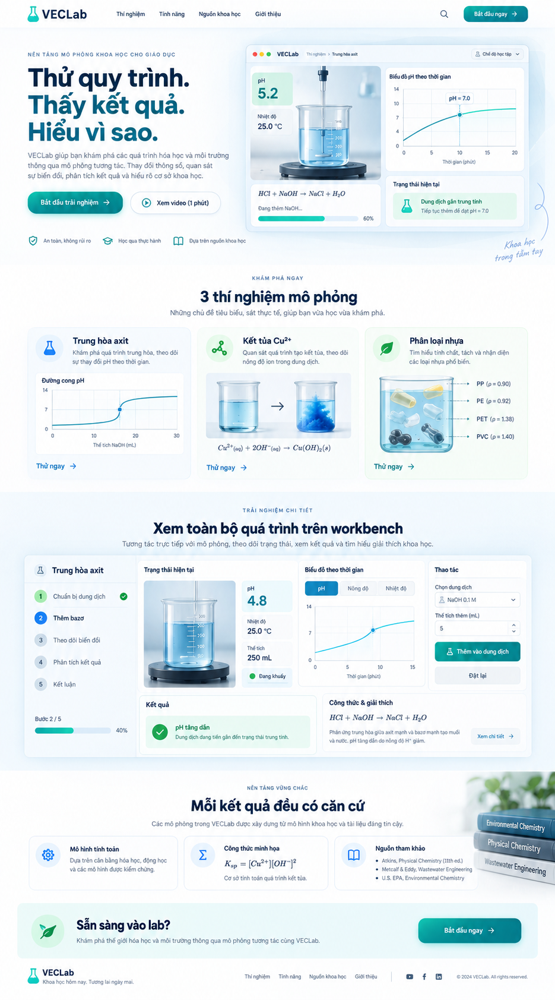
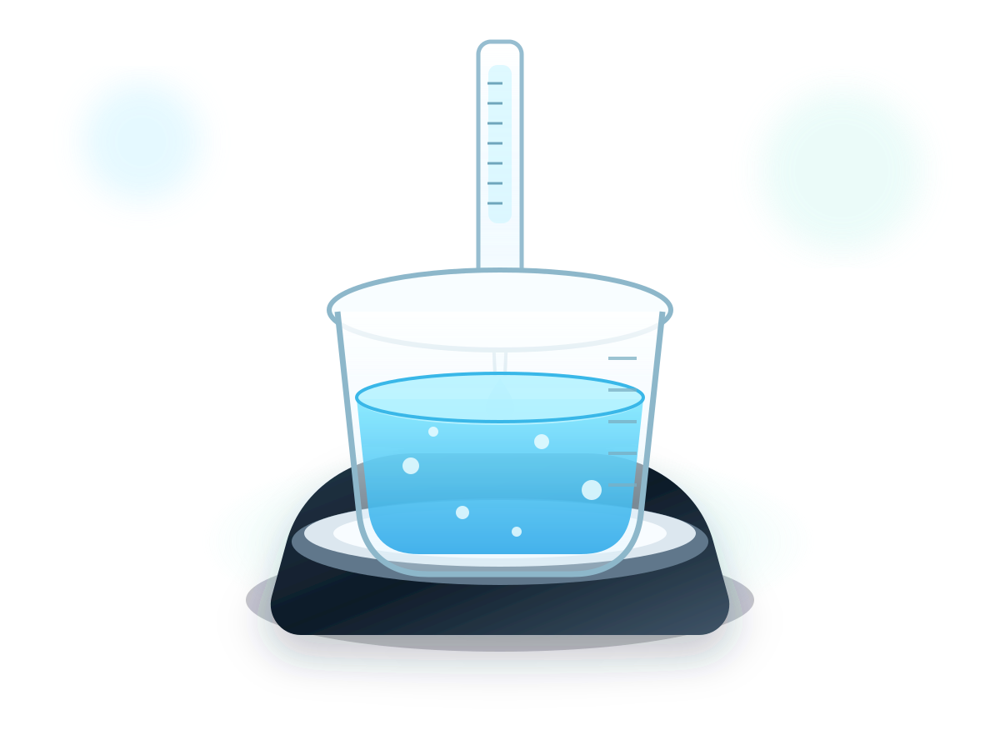
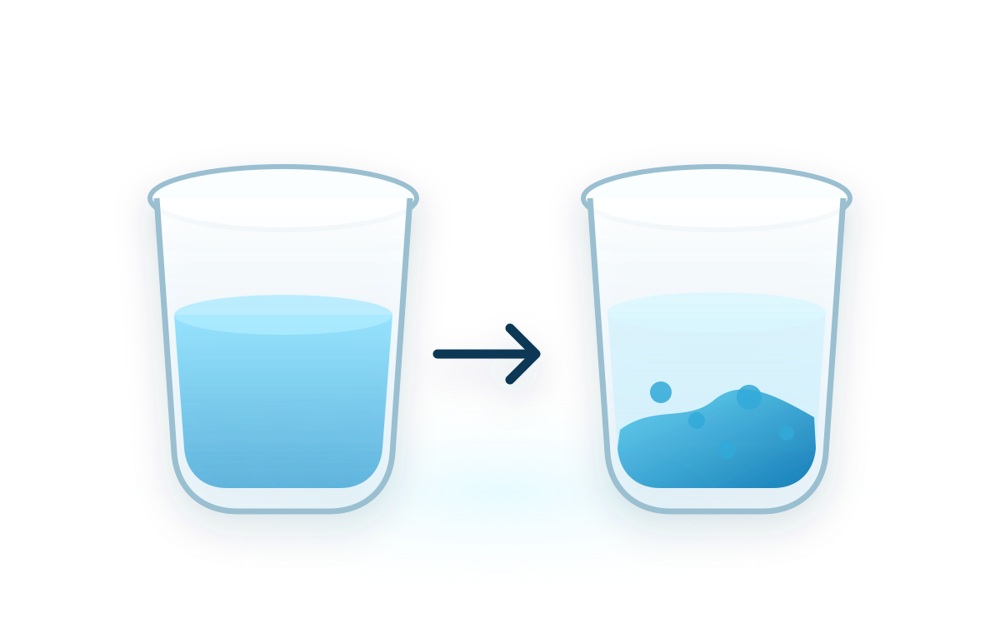
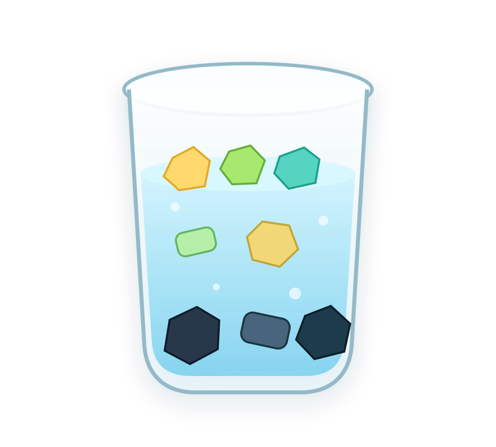
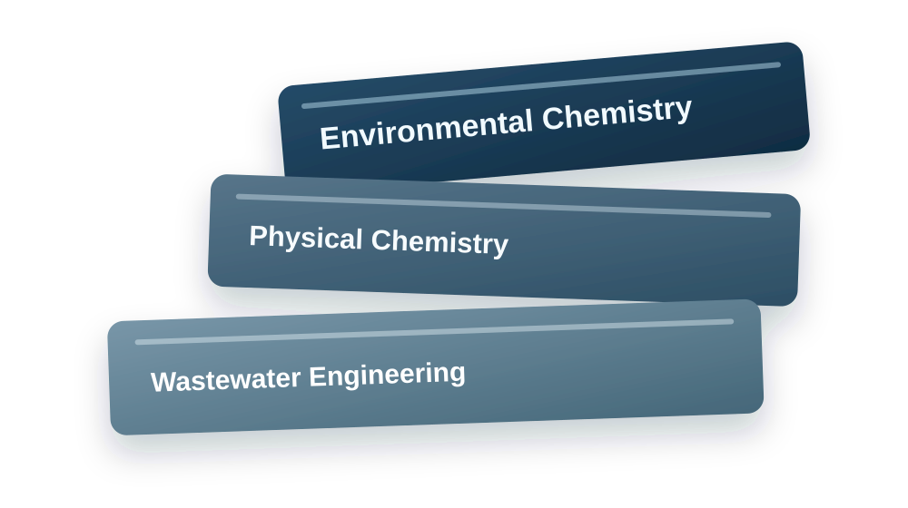

<div align="center">


# VECLab

**Nền tảng mô phỏng quy trình hóa học môi trường có căn cứ khoa học.**  
*Deterministic chemical process simulation grounded in peer-reviewed scientific literature.*

<sub><i><b>VECLab</b> là viết tắt của <b>Virtual Environmental Chemistry Laboratory</b> — Nơi khoa học thực nghiệm được tính toán chính xác, minh bạch công thức và có thể kiểm chứng độc lập.</i></sub>

<br/>

[-3B82F6?logo=googlechrome&logoColor=white)](#)
[](https://nextjs.org/)
[](https://react.dev/)
[](https://www.typescriptlang.org/)
[](https://supabase.com/)
[](#-testing--quality-gates)
[](https://nodejs.org/)
[](#)
[](#-license)

</div>

---

## 📑 Table of Contents

- [✨ Overview](#-overview)
- [🎯 Highlights](#-highlights)
- [📸 Showcase & Scenarios](#-showcase--scenarios)
- [🏛 Architecture & Boundaries](#-architecture--boundaries)
- [🛠 Tech Stack](#-tech-stack)
- [🚀 Getting Started](#-getting-started)
- [📂 Project Structure](#-project-structure)
- [🧪 Testing & Quality Gates](#-testing--quality-gates)
- [📚 Documentation](#-documentation)
- [👥 Team & Delivery Plan](#-team--delivery-plan)
- [📄 License](#-license)

---

## ✨ Overview

**VECLab** là nền tảng web mô phỏng quy trình xử lý hóa học môi trường với các mô hình toán – lý – hóa học nghiêm ngặt. Hệ thống loại bỏ hoàn toàn tính "ảo" hoặc "ngẫu nhiên" của các công cụ mô phỏng thông thường bằng cách áp dụng **Deterministic Simulation Engine** và **Scientific Evidence Register** minh bạch trích dẫn từ IUPAC, Perry's Chemical Engineers' Handbook và EPA.

> **Product Truth:** VECLab **không phải** là virtual 3D lab, game phòng thí nghiệm hay AI chatbot phỏng đoán hóa học. Đây là nền tảng mô phỏng quy trình khoa học chính xác: **cùng trạng thái ban đầu + cùng chuỗi thao tác $\rightarrow$ cho ra đúng một kết quả tính toán duy nhất** (*deterministic*).

> **Guest-First Architecture:** Người học và nhà nghiên cứu có thể trải nghiệm đầy đủ 100% kịch bản thí nghiệm trên trình duyệt mà không bị ép buộc đăng nhập. Dữ liệu tiến trình được đồng bộ cục bộ qua IndexedDB và có thể lưu chuyển an toàn lên Supabase Cloud khi kết nối tài khoản.

---

## 🎯 Highlights

- ⚗️ **Deterministic Simulation Engine** — Thuật toán cân bằng ion, điện tích và pha tuân thủ nghiêm ngặt bảo toàn vật chất, không phát sinh sai số ngẫu nhiên.
- 🧪 **3 Kịch bản MVP Hoàn chỉnh** — Mô phỏng chi tiết:
  1. *Trung hòa nước thải axit (Acid Neutralization)* với chuẩn độ buret tự động/thủ công và đường cong chuẩn độ pH phi tuyến tính.
  2. *Kết tủa kim loại nặng đồng (Copper Precipitation)* xác định nồng độ kết tủa $Cu(OH)_2$ và độ trong dung dịch.
  3. *Phân loại hạt nhựa nổi–chìm (Plastic Density Separation)* phân tách hỗn hợp PET, HDPE, PVC, PP, PS theo trọng lực và tỷ trọng dung dịch muối/cồn.
- 📖 **Scientific Evidence Register** — Mọi hằng số nhiệt động lực học ($K_a, K_w, K_{sp}$), ngưỡng chuyển màu chỉ thị và công thức đều có mã định danh nguồn tài liệu khoa học minh bạch.
- 👤 **Guest Mode Toàn năng** — Cho phép người dùng thử nghiệm tức thì không rào cản; đồng bộ mượt mà sang tài khoản lưu trữ đám mây.
- 📊 **Audit & Replay Ledger** — Mỗi thao tác (nhỏ buret, khuấy, đo sensor) được ghi nhận vào sổ cái sự kiện bảo chứng bằng mã hash SHA-256; hỗ trợ tua lại lịch sử (Undo/Redo) và tái hiện chuỗi thí nghiệm.
- 🌓 **Scientific Clean UI / Dark Mode** — Thiết kế phong cách phòng lab hiện đại, biểu đồ động cập nhật tức thời, đạt chuẩn tương phản trợ năng WCAG 2.1 AA.
- 📑 **Báo cáo thí nghiệm xuất bản** — Tổng hợp dữ liệu kết quả, đối chiếu kịch bản, so sánh các lần thực hiện và in/lưu PDF.

---

## 📸 Showcase & Scenarios

<div align="center">
  
  <p><sub><i>Giao diện tổng quan bàn làm việc khoa học VECLab (Landing page & Simulation Workbench)</i></sub></p>
</div>

### 🔬 Ba kịch bản thí nghiệm trọng tâm

| Kịch bản | Minh họa | Mô tả khoa học | Đặc tả kỹ thuật |
| :--- | :---: | :--- | :---: |
| **Trung hòa Axit**<br/>*(Acid Neutralization)* |  | Chuẩn độ NaOH vào dung dịch HCl/HNO₃, giải phương trình điện tích bậc 3 xác định chính xác bước nhảy pH quanh điểm tương đương ($pH = 7$). Chỉ thị Phenolphthalein chuyển màu hồng khi $pH \ge 8.2$. | [Spec 1.0.0](docs/experiments/acid-neutralization-spec.md) |
| **Kết tủa ion Cu²⁺**<br/>*(Copper Precipitation)* |  | Xử lý nước thải mạ điện chứa $Cu^{2+}$ bằng bazơ kiềm tạo kết tủa lam $Cu(OH)_2 \downarrow$. Tính toán cân bằng tích số tan $K_{sp}$, pH kết tủa tối ưu và phân tích hàm lượng đồng dư. | [Spec 1.0.0](docs/experiments/copper-precipitation-spec.md) |
| **Phân tách Nhựa**<br/>*(Density Separation)* |  | Phân loại hỗn hợp 5 mảnh nhựa công nghiệp (PET, HDPE, PVC, PP, PS) dựa trên cơ chế chìm–nổi qua các dung dịch biến thiên tỷ trọng $\rho$ (nước cất, nước muối NaCl, cồn Ethanol). | [Spec 1.0.0](docs/experiments/plastic-density-separation-spec.md) |
| **Căn cứ Khoa học**<br/>*(Evidence Register)* |  | Hệ thống bảo chứng nguồn tài liệu uy tín: trích lục trực tiếp từ IUPAC Gold Book, Sổ tay Kỹ sư Hóa học Perry, Tạp chí Khoa học Môi trường và Tiêu chuẩn Kỹ thuật Quốc gia. | [Evidence Docs](docs/scientific-evidence-register.md) |

---

## 🏛 Architecture & Boundaries

VECLab tuân thủ kiến trúc phân tầng lục giác nghiêm ngặt (*Hexagonal Domain-Driven Architecture*), đảm bảo lõi tính toán khoa học độc lập hoàn toàn với framework và thư viện hiển thị:

```text
┌─────────────────────────────────────────────────────────────┐
│                 Presentation Layer (React 19)               │
│        Next.js 16 App Router · Workbench · Charts · Nav      │
└──────────────────────────────┬──────────────────────────────┘
                               │ invokes
┌──────────────────────────────▼──────────────────────────────┐
│                   Application Layer (BFF)                   │
│      Simulation Session · Attempt Storage · Auth Client     │
└──────────────┬──────────────────────────────┬───────────────┘
               │ implements                   │ drives
┌──────────────▼──────────────┐┌──────────────▼───────────────┐
│     Infrastructure Layer    ││         Domain Layer         │
│  Supabase SDK · PostgreSQL  ││   Pure Scientific Engines    │
│  Row-Level Security · RPC   ││   SHA-256 Ledger · Invariants│
└─────────────────────────────┘└──────────────────────────────┘
```

- **Ranh giới Domain bất biến:** Thư mục `src/domain/` là pure TypeScript: không nhập bất kỳ module nào từ React, Next.js, Supabase, DOM, hay thậm chí `node:*` built-ins. Toàn bộ thuật toán băm SHA-256 và tuần tự hóa Canonical JSON được tự hiện thực độc lập để có thể chạy đồng nhất trên cả Client Browser và Node Server.
- **Ranh giới an ninh BFF:** Client không bao giờ gọi trực tiếp DB bằng khóa đặc quyền; mọi thay đổi trạng thái đều qua các API route được bọc kiểm tra bảo vệ (`src/app/api/_lib/guard.ts`).

---

## 🛠 Tech Stack

<div align="center">

[](https://skillicons.dev)

</div>

| Tầng công nghệ | Công cụ / Thư viện | Vai trò & Giải pháp kỹ thuật |
| :--- | :--- | :--- |
| 🌐 **Frontend Framework** | **Next.js 16** (App Router) · **React 19** | Server & Client Components, Route Groups `(auth)`, `(learner)`, `(public)`, tối ưu hóa SSR/SSG. |
| 🎨 **Giao diện & Styling** | **Vanilla CSS Design System** | Hệ thống biến CSS (Design Tokens), chế độ sáng/tối tự động lưu trữ, WCAG AA, không phụ thuộc framework UI cồng kềnh. |
| 🧠 **Lõi Mô phỏng (Domain)** | **Pure TypeScript (Strict)** | Thuật toán cân bằng hóa học, Ledger sự kiện, hàm băm SHA-256 thuần, giải thuật xác định (*deterministic*). |
| ☁️ **Cơ sở Dữ liệu & Backend**| **Supabase (PostgreSQL 15)** | Quản lý định danh người dùng (Auth SSR), kiểm soát truy cập hàng (RLS), hàm nguyên tử `commit_event_rpc`. |
| 🧪 **Kiểm thử Tự động** | **Vitest 5** & **Playwright** | 211 bài kiểm thử tự động (Unit, Fixtures, Integration, Boundaries) và kiểm thử E2E giao diện. |
| 🛡️ **Chuẩn hóa Mã nguồn** | **ESLint 9 (Flat Config)** · **TypeScript 5.9** | Bộ quy tắc kiểm tra nghiêm ngặt ranh giới kiến trúc, biến chưa dùng và cấm import chéo. |

---

## 🚀 Getting Started

### Yêu cầu môi trường
- **Node.js:** phiên bản `>= 22.12.0` (khuyên dùng Node 22 LTS hoặc 24)
- **npm:** phiên bản `>= 10.0.0`

### 1. Cài đặt mã nguồn
```bash
# Clone repository
git clone https://github.com/manhthien2005/VECLab.git
cd VECLab

# Cài đặt toàn bộ dependencies
npm install
```

### 2. Thiết lập biến môi trường
Tạo file cấu hình môi trường `.env.local` từ mẫu [.env.example](file:///.env.example):
```bash
cp .env.example .env.local
```
Cấu hình các tham số Supabase của bạn (nếu chạy local hoặc kết nối Supabase Cloud):
```ini
NEXT_PUBLIC_SUPABASE_URL=https://your-project.supabase.co
NEXT_PUBLIC_SUPABASE_ANON_KEY=your-anon-key
SUPABASE_SERVICE_ROLE_KEY=your-service-role-key
```
*(Lưu ý: Chế độ Guest Mode vẫn hoạt động bình thường ngay cả khi chưa kết nối Supabase).*

### 3. Khởi chạy máy chủ phát triển
```bash
npm run dev
```
Mở trình duyệt tại: `http://localhost:3000` để bắt đầu trải nghiệm.

### 4. Kiểm tra toàn diện hệ thống (Verification Gate)
```bash
npm run verify
```
Lệnh này sẽ tự động chạy toàn bộ quy trình: Typecheck $\rightarrow$ Linter $\rightarrow$ Vitest Suites $\rightarrow$ Production Build.

---

## 📂 Project Structure

```text
VECLab/
├── .agents/                 # Antigravity AI custom skills & instructions
├── .claude/                 # Claude Code workspace configuration & tools
├── docs/                    # Tài liệu đặc tả kỹ thuật, kiến trúc và hóa học
│   ├── experiments/         # Đặc tả chi tiết 3 kịch bản thí nghiệm (1.0.0)
│   ├── team/                # Phân công trách nhiệm 6 thành viên & Delivery plan
│   ├── core-project-scope.md
│   ├── system-architecture.md
│   ├── scientific-evidence-register.md
│   └── web-application-scope.md
├── public/                  # Static assets (SVG diagrams, icons)
├── reference/               # Thiết kế mẫu & hình ảnh đối chiếu UI (approved-landing)
├── src/
│   ├── app/                 # Next.js 16 App Router (Pages, Layouts, API routes)
│   │   ├── (auth)/          # Các trang xác thực: sign-in, sign-up, reset-pwd
│   │   ├── (learner)/       # Không gian học viên: lab, compare, account
│   │   ├── (public)/        # Trang mở: landing page, experiments, evidence
│   │   └── api/             # Backend For Frontend (BFF) endpoints
│   ├── application/         # Application services: session, repositories, projection
│   ├── content/             # Từ điển nội dung khoa học, văn bản song ngữ
│   ├── domain/              # Pure Domain: engine hóa học, ledger SHA-256, invariant
│   ├── features/            # UI Components: workbench, charts, landing visuals
│   ├── infrastructure/      # Kết nối bên ngoài: Supabase server/browser clients
│   └── shared/              # Tiện ích chung, định dạng dữ liệu, UI cơ bản
├── supabase/                # Migrations SQL, hàm RPC, cấu hình RLS & Grants
├── tests/                   # Bộ test tự động (Unit, Integration, SQL stubs, Fixtures)
├── design.md                # Đặc tả hệ thống thiết kế giao diện (Design System)
├── eslint.config.mjs        # Cấu hình linter phẳng & kiểm soát ranh giới import
├── package.json
└── tsconfig.json
```

---

## 🧪 Testing & Quality Gates

Mọi commit trên VECLab đều phải vượt qua bộ kiểm soát chất lượng nghiêm ngặt:

| Lệnh | Mục đích | Số lượng / Trạng thái |
| :--- | :--- | :---: |
| `npm run typecheck` | Kiểm tra tính nhất quán của kiểu dữ liệu TypeScript | **0 lỗi (Zero any)** |
| `npm run lint` | Quét quy tắc ESLint, kiểm tra import ranh giới Domain | **PASS** |
| `npm run test` | Chạy bộ unit & integration tests với Vitest | **16/16 suites · 211 tests passed** |
| `npm run test:e2e` | Kiểm thử hành vi người dùng đầu cuối với Playwright | **Sẵn sàng** |
| `npm run build` | Biên dịch bản build tối ưu hóa cho môi trường Production | **17/17 routes compiled** |

```bash
# Chạy toàn bộ kiểm tra trong 1 lệnh duy nhất
npm run verify
```

---

## 📚 Documentation

Tài liệu dự án được tổ chức chi tiết và có thứ bậc ưu tiên rõ ràng trong thư mục `docs/`:

| Tài liệu | Nội dung trọng tâm |
| :--- | :--- |
| [Mục Lục Toàn Diện](docs/README.md) | Bản đồ điều hướng và thứ tự đọc tài liệu dự án |
| [Core Project Scope](docs/core-project-scope.md) | Giới hạn sản phẩm, định nghĩa tính năng MVP và những gì nằm ngoài scope |
| [Web Application Scope](docs/web-application-scope.md) | Kiến trúc màn hình, hành vi khách/học viên và lưu đồ trạng thái |
| [System Architecture](docs/system-architecture.md) | Ranh giới các module, hợp đồng dữ liệu và giải pháp kỹ thuật |
| [Scientific Evidence Register](docs/scientific-evidence-register.md) | Trích dẫn nguồn tài liệu khoa học cho mọi hằng số và công thức |
| [Acid Neutralization Spec](docs/experiments/acid-neutralization-spec.md) | Mô hình cân bằng axit - bazơ và chuẩn độ |
| [Copper Precipitation Spec](docs/experiments/copper-precipitation-spec.md) | Mô hình kết tủa hydroxit đồng và cân bằng ion |
| [Plastic Density Separation Spec](docs/experiments/plastic-density-separation-spec.md) | Mô hình phân tách hạt nhựa theo khối lượng riêng |
| [Team Coordination Plan](docs/team/README.md) | Cơ cấu phân chia trách nhiệm và tiến độ đội ngũ 6 người |

---

## 👥 Team & Delivery Plan

Dự án được xây dựng và phối hợp chặt chẽ bởi đội ngũ 6 thành viên hướng tới cột mốc MVP hoàn thiện:

| Thành viên | Trách nhiệm chính | Phạm vi phụ trách | Hồ sơ chi tiết |
| :--- | :--- | :--- | :---: |
| **Thiên (ThienPDM)** | **Technical Lead** & Architecture | Kiến trúc toàn hệ thống, Process Core, API BFF, tích hợp | [Charter](docs/team/thien-technical-lead.md) |
| **Khoa** | **Simulation Engine Lead** | Mô hình hóa học, thuật toán cân bằng, golden test cases | [Charter](docs/team/khoa-simulation-lead.md) |
| **Hoàng** | **Application Lead** | Mô-đun Simulation Workbench, báo cáo, so sánh, tương tác web | [Charter](docs/team/hoang-application-lead.md) |
| **Mạnh** | **Platform & DevOps Lead** | Supabase, PostgreSQL, RLS, CI/CD pipeline, triển khai cloud | [Charter](docs/team/manh-platform-devops-lead.md) |
| **Ngân** | **Product & UX Lead** | Thiết kế giao diện, luồng người dùng Figma, Design QA | [Charter](docs/team/ngan-product-ux-lead.md) |
| **Hân** | **Content & QA Lead** | Thẩm định nội dung khoa học, Evidence register, kiểm thử thủ công | [Charter](docs/team/han-content-qa-lead.md) |

---

## 📄 License

Dự án này được phát triển phục vụ mục đích nghiên cứu, học thuật và phát triển sản phẩm khoa học. Mọi quyền tác giả thuộc về đội ngũ sáng lập **VECLab**.

<div align="center">
<sub>Xây dựng với niềm đam mê khoa học thực nghiệm và công nghệ hiện đại.</sub>
</div>
